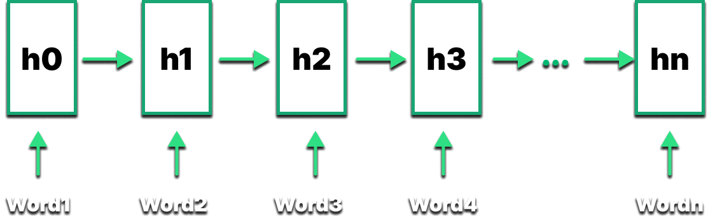
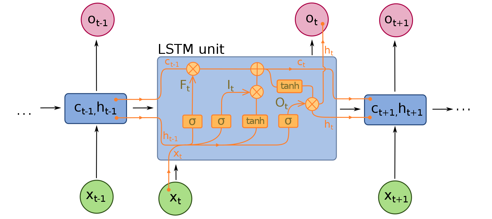
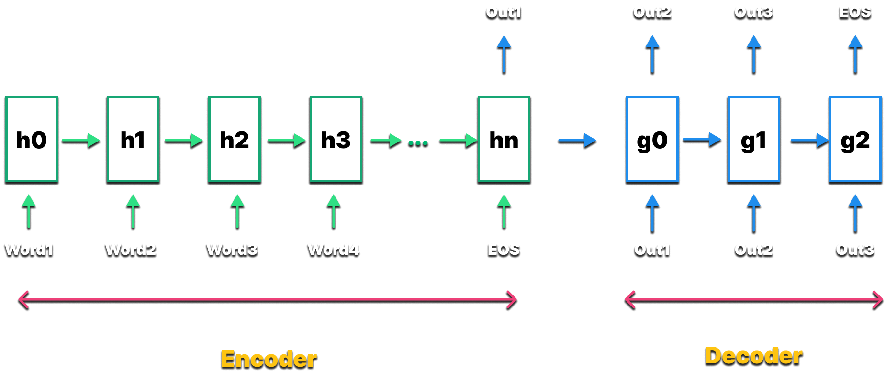

<strong>

# Natural Language Processing

- So, basically working with text data has 3 types of Machine Learning Lagorithm associated with it:

  - Natural Language Processing
  - Deep Learning
  - Deep Natural Language Processing

    - Sequence-to-Sequence

- Sequence-to-Sequence models are the most cutting edge, the most powerful models that exist right now for natural language processing, and that's what we will be looking at in the content ahead.

### Classical vs Deep Learning Models

- Let's understand this with some examples:

  - If/Else Rules (Chatbot): It's a clear part of NLP. What they entail is a huge list of possible questions and answer to those questions and so once, somebody in the chat, ask that question or we can identify that part of the sentence in the question in the question we have recorded. Then we will give them the correct answer , the answer that is associated with the question.

  - Speech Recognition (Audio Frequency Components Analysis): In essence, what happens is we look at the sound wave of somebody talking, some pre-recorded or some real time audio over human speech, and then we try to identify what waveforms exist in there. This is again a key example of Natural Language Processing.

  - Bag of Words Model (Classification): It is a very popular approach for text analysis or Natural Language Processing. It can be a example for either NLP or DNLP as well. What it does is, there's a bag of words, and for instance, we might have a lot of texts. So, it matches the occurance of certain keyword with either it being a positive result or a negativve result. As a result the model will be able to classify the outcome based on positive or negative result inferred by the text.

  - CNN for Text Recognition (Classification): It is a pretty good example of DNLP model. This method uses Neural Networks for Text recognition and hence used for text processing. So, the way it works is, the words are transformed into matrix and that's done through an operation called embedding of words. And then once they are in a matrix, same principles that apply to image processing using CNNs are applied here. Then they are pooled, max pooled and min pooled their smaple abd then they're flattened and then we have the prediction.

### End-to-End Deep Learning Models

- The reason why we are diving into this area is, it will help us understand why Seq2Seq are actually so good because Seq2Seq models are type of End-to-End Deep learning models.
- To understand what's a end-to-end deep learning model, consider this example. Let's say we have a customer calling to the customer centre, the customer is responded by a Voice-based Chatbot that listens to the user input and processes the speech and converting it into text and than the text query is processed by another ML algorithm and it sends the respond back to the Speech Recognition Model and provides the response to the customer by converting text response to speech. This is a pretty good example of end-to-end deep learning model, as it involves use of 2 ML Models, to complete the flow and clearly there's a huge majority that the response might not be correct because, there's a misconnect b'w the 2 ML algorithms used in this case.

- It's not 1 algorithm doing all the thing, and there are 2 algorithms with it's training happening seprately, we will run into problems, not nessecarily all the time, but it does happen quite sometime.

### Bag of Words Model

- So. let's assume an example, where a guy writes us a email asking, if we are back. The Wikipedia says in general a human uses only 3000 words out of almost 1.7 lakh words only at an average, assuming we use 20000 of the words, we categorize the words as SOS(Start of Statement), EOS(End of Statement), general words and than the remaining are special words.
- So, let's assume that these 20,000 words are represented by an array or list of size 20,000. and we convert the sentence we recieved in the mail to a vector. Now our model needs to be trained to a dataset where for every statement is tested against it's response.

- Now, once we have the data ready we're going to apply a model to create our bag of words. One of the models we can apply here to create our bag of words is logisitic regression. Once trained, it's likely that the model can yeild, what's likely to yield a yes, and what is likely to be a no. This is a NLP based approach.
- Also, instead of a logisitc regression we can use a Neural Network cause we have a vector of 20,000 words, we can feed them as input to the input layer and obtain the output accordingly. This is an example of DNLP approach.

### Seq2Seq Architecture

- Before, diving deep into the Seq2Seq Model, we shoudl know about the issues with Bag of Words Model:

  - Fixed Size Input - The Test data must have size same as that of the training data.
  - Doesn't take word order into account.
  - Fixed Size Output

- The Solution to the problem is Recurrent Neural Networks. RNNs are of various types:

  - one-to-one
  - one-to-many
  - many-to-one
  - many-to-many

- Here every single box is not one cell, it's actually a whole layer of neurons is represented by a single box. when working with a quite a huge text, than in such case many-to-many RNNs are the most effective. Because every time we will have a variable length input, and hence a variable length output.
- To understand this better, let's move back to the understanding the approach back. Let's suppose the sentece is "Hello Kirill, Checking if you are back to  Oz.". So, what we are gonna do is, we take each signle word, and we code them. So, we're going to create a different route this time. One way to create it is we take those from that big vector of 20,000, and we only take the position of every word i.e. what is the position of those words in that collection of 20,000 words. This is how we construct the vector and the length of vector depends on the number of words in the input text.

- So, we're going to create our neural network with the text. But just keep in mind that in a machine sense, we do need to have numbers and it is possible to construct the vector of numbers from our email. And the vector size would be the same as the length of the mail. It will have SOS at the start and EOS at end. We drop SOS becuase, it's not that important. every sentence will start with SOS. While EOS is important because it will dictate that the output will terminate. So, now what we will do is we wil feed these values into our RNN.

- As soon as we would encounter an EOS. It will start to process the statement. As it is a RNN, we can feed in any number of words. The inputs here are like parameters in the algorithm which is adjusted to the length of our input. Once, it is done, the network is going to start predicting approach. So, for every predicition, there are 20,00 possible outcomes, here we mean to say that for every word there's a probability of (1/20000) of any word appearing in the output. So, the end result will spit out a probability score for the options that it has, and it assigns probabilities to different words that it can pick up, and than pick the one with highest probabilty. It's upto the Neural Network to generate the right response, based on the training it has been through. So, the output generaed goes as a feedback for the next output which is what actually happens in a LSTM based model. This will make sure we're taking into account not just a memory that's flowing through, but we're using the output we generated before and that will help us help the neural netowrk preserve understand the meaning.

- The Seq2Seq Model is based on Encoder-Decoder kind of architecture, where the input is encoded and the decoder decodes the upcoming response by taking the preceeding output as a feedback for the further output to be generated. So, basically we have 2 RNNs attached to each other.

### Seq2Seq Training

</strong>
