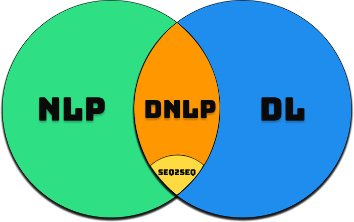

<strong>

# Natural Language Processing

- So, basically working with text data has 3 types of Machine Learning Lagorithm associated with it:

  - Natural Language Processing
  - Deep Learning
  - Deep Natural Language Processing

    - Sequence-to-Sequence

- Sequence-to-Sequence models are the most cutting edge, the most powerful models that exist right now for natural language processing, and that's what we will be looking at in the content ahead.

#### Classical vs Deep Learning Models

- Let's understand this with some examples:

  - If/Else Rules (Chatbot): It's a clear part of NLP. What they entail is a huge list of possible questions and answer to those questions and so once, somebody in the chat, ask that question or we can identify that part of the sentence in the question in the question we have recorded. Then we will give them the correct answer , the answer that is associated with the question.

  - Speech Recognition (Audio Frequency Components Analysis): In essence, what happens is we look at the sound wave of somebody talking, some pre-recorded or some real time audio over human speech, and then we try to identify what waveforms exist in there. This is again a key example of Natural Language Processing.

  - Bag of Words Model (Classification): It is a very popular approach for text analysis or Natural Language Processing. It can be a example for either NLP or DNLP as well. What it does is, there's a bag of words, and for instance, we might have a lot of texts. So, it matches the occurance of certain keyword with either it being a positive result or a negativve result. As a result the model will be able to classify the outcome based on positive or negative result inferred by the text.

  - CNN for Text Recognition (Classification): It is a pretty good example of DNLP model. This method uses Neural Networks for Text recognition and hence used for text processing. So, the way it works is, the words are transformed into matrix and that's done through an operation called embedding of words. And then once they are in a matrix, same principles that apply to image processing using CNNs are applied here. Then they are pooled, max pooled and min pooled their smaple abd then they're flattened and then we have the prediction.

#### End-to-End Deep Learning Models

- The reason why we are diving into this area is, it will help us understand why Seq2Seq are actually so good because Seq2Seq models are type of End-to-End Deep learning models.
- To understand what's a end-to-end deep learning model, consider this example. Let's say we have a customer calling to the customer centre, the customer is responded by a Voice-based Chatbot that listens to the user input and processes the speech and converting it into text and than the text query is processed by another ML algorithm and it sends the respond back to the Speech Recognition Model and provides the response to the customer by converting text response to speech. This is a pretty good example of end-to-end deep learning model, as it involves use of 2 ML Models, to complete the flow and clearly there's a huge majority that the response might not be correct because, there's a misconnect b'w the 2 ML algorithms used in this case.

It's not 1 algorithm doing all the thing, and there are 2 algorithms with it's training happening seprately, we will run into problems, not nessecarily all the time, but it does happen quite sometime.

</strong>
