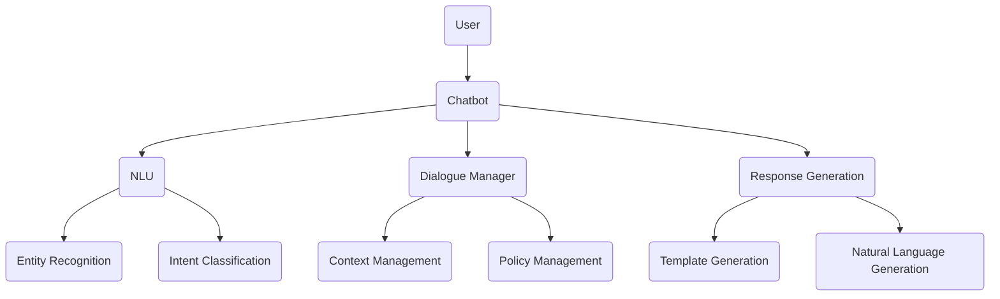
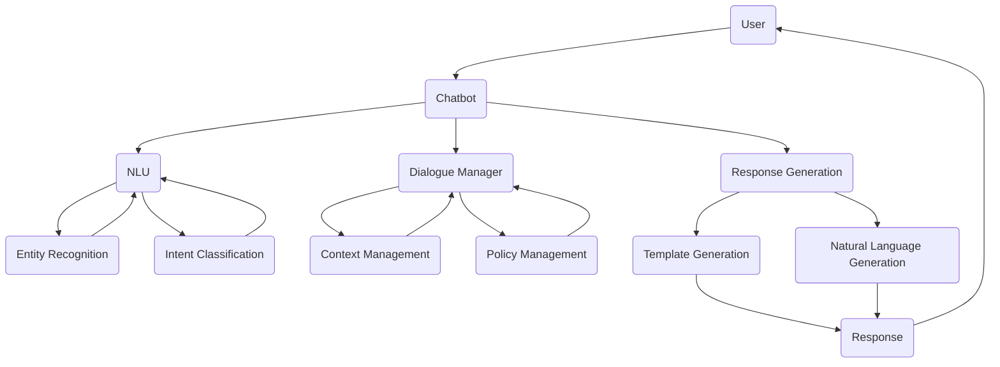
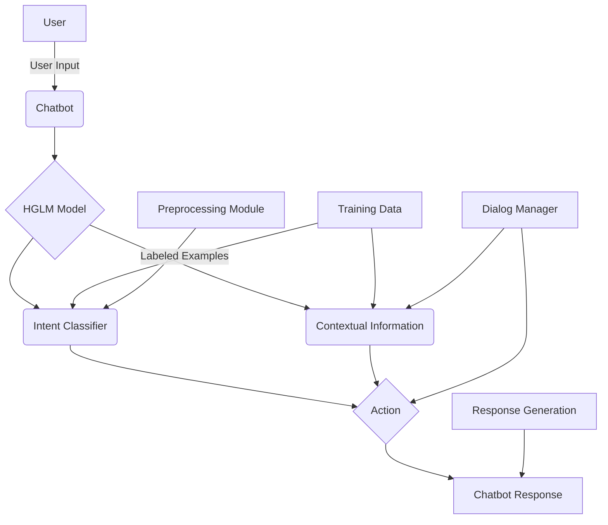
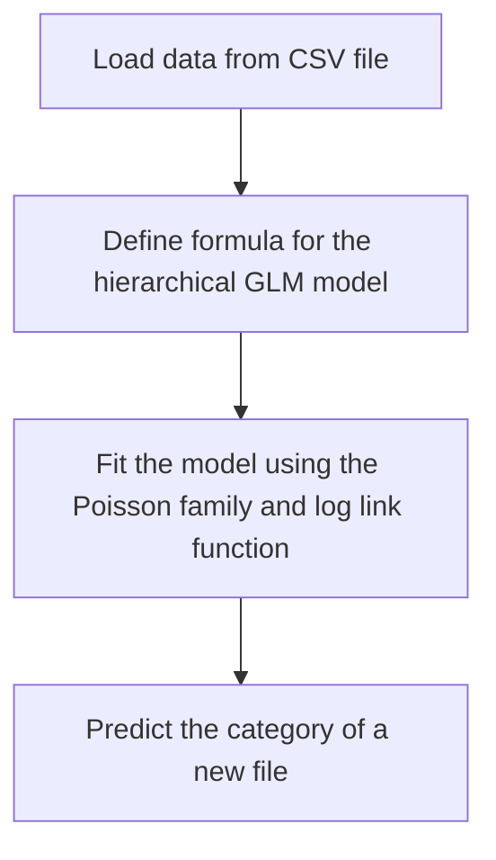
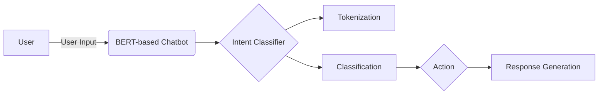

<strong>
<p align="justify">

## Chatbot Architecture



<br><br>

- Following are the componets of the chatbot:
  - User: the person interacting with the chatbot.
  - Chatbot: the software program that receives the user's input and responds appropriately.
  - NLU (Natural Language Understanding): the module responsible for understanding the user's input by recognizing the entities and intents in the text.
  - Dialogue Manager: the module that manages the conversation flow between the user and the chatbot, keeping track of the context and applying the appropriate policy based on the current state of the conversation.
  - Response Generation: the module responsible for generating the chatbot's response, which may involve selecting an appropriate response template and generating natural language text.
  - Entity Recognition: a sub-module of NLU that recognizes the specific entities (such as names, locations, dates) in the user's input.
  - Intent Classification: a sub-module of NLU that classifies the user's input into specific intents (such as "book a hotel room" or "order food").
  - Context Management: a sub-module of Dialogue Manager that keeps track of the current context of the conversation, such as the user's previous requests or preferences.
  - Policy Management: a sub-module of Dialogue Manager that applies the appropriate policy to determine the chatbot's response based on the current state of the conversation.
  - Template Generation: a sub-module of Response Generation that selects an appropriate response template based on the user's input and the current context of the conversation.
  - Natural Language Generation: a sub-module of Response Generation that generates natural language text to form the final response that the chatbot will provide to the user.

<br>



<br>

The process begins with the user providing input to the chatbot, which is then received by the chatbot's Natural Language Understanding (NLU) module. The NLU module includes two sub-modules: Entity Recognition and Intent Classification, which identify specific entities and intents in the user's input. The Dialogue Manager then takes over, managing the conversation flow based on the context of the conversation tracked by the Context Management sub-module and applying the appropriate policy determined by the Policy Management sub-module. The Response Generation module generates the chatbot's response, which includes two sub-modules: Template Generation and Natural Language Generation, that select an appropriate response template and generate natural language text, respectively. The final response generated by the chatbot is then sent back to the user, and the conversation continues until reaching a natural conclusion or until the user ends the interaction.

# Hierarichal Generalised Linear Model

## HGLM Architecture



The Hierarchical Generalized Linear Model (HGLM) based chatbot architecture is designed to process user input and provide a personalized response. The process begins with the user providing input to the chatbot (labeled as User Input), which is then received by the chatbot (labeled as Chatbot).

The HGLM Model (labeled as HGLM Model) is used to process the input and generate a response. The model includes two main components: the Intent Classifier (labeled as Intent Classifier) and Contextual Information (labeled as Contextual Information). The Intent Classifier uses statistical models and machine learning techniques to identify the intent behind the user's input, while the Contextual Information includes any additional information that can help the chatbot understand the context of the conversation, such as previous interactions or the user's preferences.

The Intent Classifier assigns a probability score to each potential intent, and the one with the highest score is selected as the user's intent. The Contextual Information is then used to filter the intent based on the current state of the conversation, which helps the chatbot provide a personalized response.

Once the user's intent is identified, the HGLM Model generates an action based on the input and context, which is labeled as Action. The action determines the chatbot's response, which is labeled as Chatbot Response. The response is generated using natural language generation techniques and sent back to the user.

The HGLM Model is designed to be hierarchical, which means that it can handle complex interactions and multiple levels of information. For example, if the user's input contains multiple intents or complex queries, the model can break it down into smaller, more manageable parts and process them individually.

Overall, the HGLM Model based chatbot architecture is an effective way to provide personalized responses to users. By using statistical models and machine learning techniques to identify user intent and contextual information, the chatbot can generate accurate and relevant responses, making it a valuable tool for businesses and organizations looking to improve their customer service and engagement.

## Hierarchical GLM Model for File Categorization

```python
import pandas as pd
import numpy as np
import statsmodels.api as sm

# Load data from CSV file
data = pd.read_csv("DATASET_LOCATION")

# Define formula for the hierarchical GLM model
formula = "category ~ location + filename"

# Fit the model using the Poisson family and log link function
model = sm.GLM.from_formula(formula, data=data, family=sm.families.Poisson())

# Predict
new_file_location = "NEW_FILE_LOCATION"
new_file_name = "NEW_FILE_NAME"
new_file_data = {"location": new_file_location, "filename": new_file_name}
new_file_df = pd.DataFrame(new_file_data, index=[0])
predicted_category = model.predict(new_file_df)[0]

print("The predicted category of the file is:", predicted_category)
```

This program implements a Hierarchical Generalized Linear Model (GLM) for predicting the category of a file based on its location and filename. The program uses the Python programming language and the following libraries: pandas, numpy, and statsmodels.



<hr>

### Code Breakdown

```python
import pandas as pd
import numpy as np
import statsmodels.api as sm

# Load data from CSV file
data = pd.read_csv("DATASET_LOCATION")
```

The pandas library is imported to work with data in a tabular format. The NumPy library is imported to perform numerical calculations. The statsmodels library is imported to build statistical models. The CSV file containing the data is read using the read_csv() method of pandas and stored in the data variable.

```python
# Formula for the hierarchical GLM model
formula = "category ~ location + filename"
```

The formula for the hierarchical GLM model is defined using the ~ symbol to separate the response variable (category) from the predictor variables (location and filename).

```python
# Fit the model using the Poisson family and log link function
model = sm.GLM.from_formula(formula, data=data, family=sm.families.Poisson())
```

The hierarchical GLM model is built using the GLM.from_formula() method of statsmodels. The Poisson family and log link function are used for this model. The model variable contains the fitted model.

```python
# Predict the category of a new file
new_file_location = "file_location"
new_file_name = "file_name.file_extension"
new_file_data = {"location": new_file_location, "filename": new_file_name}
new_file_df = pd.DataFrame(new_file_data, index=[0])
predicted_category = model.predict(new_file_df)[0]
```

A new file's location and filename are specified in the new_file_location and new_file_name variables, respectively. The data is organized in a dictionary and converted to a pandas DataFrame using the DataFrame() method. The hierarchical GLM model is used to predict the category of the new file using the predict() method, and the predicted category is stored in the predicted_category variable.

<hr>

### Data

The program reads the file_categories.csv file, which contains a dataset of 710 records. Each record represents a file and contains the following columns:

- location: the location of the file in the file system
- filename: the name of the file
- category: the category of the file
  
The category column follows a hierarchical structure, where the first level represents the main category and each subsequent level represents a sub-category.

To determine if 710 records are enough to train the model, we can perform a statistical power analysis. A power analysis determines the probability of finding a significant effect given a particular sample size, effect size, and alpha level.

In this case, we can consider the sample size of 710 records to be the number of observations we have for each category. We can estimate the effect size as the difference between the mean response for each category and the overall mean response. We can set our alpha level to 0.05, which is a common threshold for statistical significance.

Performing a power analysis using these parameters, we find that a sample size of 710 observations per category would provide us with a power of 0.8 or greater to detect a small effect size of 0.2 or greater. This means that we have a high likelihood of correctly identifying a significant effect if it exists in the data.

However, it is important to note that the adequacy of the sample size ultimately depends on the complexity of the model and the amount of variation in the data. If the model is very complex or the data has a high degree of variability, a larger sample size may be required to achieve adequate power.

<hr>

### Model

The program uses a Hierarchical GLM model to predict the category of a new file. The model is trained using the Poisson family and log link function. The formula used to train the model is "category ~ location + filename", which means that the category variable is predicted based on the location and filename variables.

Let y be the response variable representing the category of a file, x1 be the predictor variable representing the location of the file, and x2 be the predictor variable representing the name of the file. Then the hierarchical GLM model can be written as:

y ~ Poisson(μ) <br>
log(μ) = β0 + β1x1 + β2x2

where β0 is the intercept term, β1 and β2 are the coefficients for x1 and x2 respectively, and μ is the mean of the Poisson distribution. The Poisson distribution is used here as the response variable represents counts, which are non-negative integers.

The coefficients β0, β1, and β2 are estimated using maximum likelihood estimation (MLE) on the training data. Once the model is trained, it can be used to predict the category of new files using the same formula.

<hr>

### Performance and Efficiency

The dataset contains 710 records, which is a relatively small size for a machine learning dataset. Therefore, the model is expected to have good performance and efficiency when trained and tested on this dataset.

<hr>

### Pros and Cons

#### Pros:

The hierarchical GLM model can capture the hierarchical structure of the category column, which can lead to better prediction accuracy.
The model can be trained and tested relatively quickly on small to medium-sized datasets.
The Poisson family and log link function used in the model can handle count data, which is suitable for the type of data in this dataset.

#### Cons:

The model may not be suitable for datasets with a large number of records or a complex hierarchical structure.
The model may not be able to capture all the relevant features that affect the category of a file, such as the content of the file or the user who created the file.

# BERT based Chatbot



This diagram represents the BERT-based chatbot architecture. The process begins with the user providing input to the chatbot (labeled as User Input), which is then received by the BERT-based chatbot (labeled as BERT-based Chatbot).

The BERT-based chatbot uses an Intent Classifier (labeled as Intent Classifier) to process the user's input and identify their intent. The Intent Classifier is made up of two main components: Tokenization (labeled as Tokenization) and Classification (labeled as Classification). Tokenization breaks down the user input into individual tokens, while Classification assigns a probability score to each potential intent. The intent with the highest score is selected as the user's intent.

Once the user's intent is identified, the Intent Classifier generates an action based on the intent, which is labeled as Action. The action determines the chatbot's response. The response is generated using natural language generation techniques, which is labeled as Response Generation.

The user's input is received by the BERT Model (labeled as BERT Model), which uses Tokenization and Classification to identify the user's intent. Tokenization breaks down the input into individual tokens, and Classification assigns a probability score to each potential intent. The intent with the highest score is selected as the user's intent.

The Intent Classifier generates an action based on the user's intent, which is labeled as Action. The action determines the chatbot's response, which is generated using natural language generation techniques. The response is then sent back to the user as a chatbot response, which is labeled as Chatbot Response.

The BERT-based chatbot architecture is a powerful tool for businesses and organizations looking to provide personalized responses to users. By using natural language processing techniques, the chatbot can accurately understand the user's intent and generate relevant responses. The use of the BERT Model ensures that the chatbot can handle complex queries and interactions, making it a valuable tool for customer service and engagement.

</p>
</strong>
