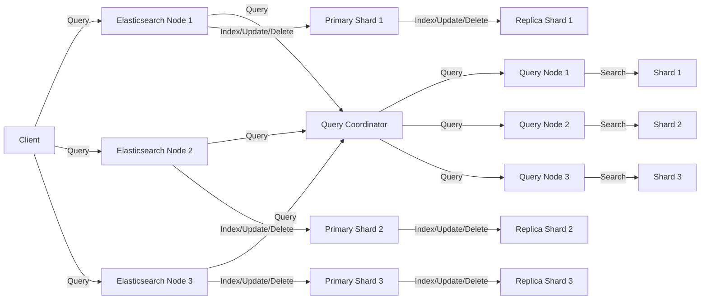

<p align="justify">

# ElasticSearch


## Architecture of ElasticSearch



- Elasticsearch is a distributed search and analytics engine that is designed to scale horizontally. It consists of a cluster of nodes, which can be either master-eligible nodes or data nodes. Each node is identified by a unique name, and each node can act as a client or a server.

- The architecture diagram shows a simplified Elasticsearch cluster consisting of three nodes, but in practice, an Elasticsearch cluster can have many more nodes. The client sends queries to any of the Elasticsearch nodes, which act as a gateway to the cluster. The node that receives the query acts as the coordinating node, which is responsible for routing the query to the relevant shards and aggregating the results.

- Each node contains multiple components, including the network service, the HTTP server, the transport service, and the node service. The network service is responsible for handling incoming and outgoing network connections. The HTTP server provides a RESTful API that can be used to interact with Elasticsearch. The transport service is used by nodes to communicate with each other. The node service is responsible for managing the node's lifecycle, including starting and stopping the node and managing the node's configuration.

- Each node also contains a cluster state service, which is responsible for managing the state of the cluster. The cluster state service maintains a list of all nodes in the cluster and their status, as well as a list of all indices in the cluster and their mappings.

- Each index in Elasticsearch is divided into one or more shards, which are distributed across the nodes in the cluster. Each shard has a unique identifier, and each shard can be either a primary shard or a replica shard. The primary shard is responsible for indexing and serving search requests for that shard, while the replica shard provides redundancy and fault tolerance.

- In the architecture diagram, each node contains one primary shard and one replica shard for each index. For example, Node 1 contains primary shard 1 and replica shard 1 for Index 1. The primary shard is responsible for indexing and serving search requests for that shard, while the replica shard provides redundancy and fault tolerance.

- When a client sends a search query to Elasticsearch, the coordinating node receives the query and routes it to the relevant shards. The coordinating node sends the query to each query node that hosts a shard that matches the query. Each query node executes the query on its shard and returns the results to the coordinating node. The coordinating node then collates the results from all the query nodes and returns the final results to the client.

- Overall, the architecture of Elasticsearch is designed to be highly scalable and fault-tolerant. By distributing data and processing across multiple nodes, Elasticsearch can handle large volumes of data and search queries with low latency and high throughput.

- Elasticsearch AI model does not hallucinate. Elasticsearch is a search engine based on the Lucene library and is designed to handle and search large amounts of data efficiently. It uses machine learning algorithms and natural language processing techniques to provide better search results, but it does not have the ability to hallucinate or create data that does not exist. It can only process and analyze the data that has been indexed into it.

## Flowchart


The above flowchart shows the high-level flow of a search query in Elasticsearch. A client sends a search query to an Elasticsearch node, which then routes the query to a query coordinator. The query coordinator broadcasts the query to all relevant query nodes, which in turn query the corresponding shards. The search results are then collated and returned to the client.

## Code

`Elasticsearch Indexing`

```python

from elasticsearch import Elasticsearch
import os

# Connect to Elastic Search
es = Elasticsearch([{'host': 'localhost', 'port': 9200}])

# Set the directory path
dir_path = "/path/to/git/repository/"

# Define a function to traverse the directory tree and extract information from each file
def process_directory(path):
    for filename in os.listdir(path):
        filepath = os.path.join(path, filename)
        if os.path.isdir(filepath):
            process_directory(filepath)
        else:
            with open(filepath, 'r') as f:
                content = f.read()
                # Extract relevant information from the file
                # For example, you can extract the filename, content, and metadata
                # Then format the extracted information into a JSON document
                json_doc = {
                    "filename": filename,
                    "content": content,
                    "metadata": {
                        "category": os.path.basename(path),
                        "subcategory": os.path.basename(os.path.dirname(path))
                    }
                }
                # Send the JSON document to Elastic Search index
                es.index(index='git_repo', body=json_doc)

# Traverse the directory tree starting from the root directory
process_directory(dir_path)

```

### Code Breakdown

```python
es = Elasticsearch([{'host': 'localhost', 'port': 9200}])
```

This code connects to Elasticsearch running on the local machine at the default port of 9200. You can change the host and port parameters to match your Elasticsearch setup. Than we need to define a function to search the directory tree.

```python
def process_directory(path):
    for filename in os.listdir(path):
        filepath = os.path.join(path, filename)
        if os.path.isdir(filepath):
            process_directory(filepath)
        else:
            with open(filepath, 'r') as f:
                content = f.read()
                # Extract relevant information from the file
                # For example, you can extract the filename, content, and metadata
                # Then format the extracted information into a JSON document
                json_doc = {
                    "filename": filename,
                    "content": content,
                    "metadata": {
                        "category": os.path.basename(path),
                        "subcategory": os.path.basename(os.path.dirname(path))
                    }
                }
                # Send the JSON document to Elastic Search index
                es.index(index='git_repo', body=json_doc)
```

`process_directory(path)` takes a directory path as input and recursively processes each file in the directory tree. The function iterates over the files and directories in the specified path using the `os.listdir(path)` function. If a directory is encountered, the function calls itself recursively with the directory path as the input. If a file is encountered, the function opens the file, reads its contents, extracts relevant information (e.g., filename, content, metadata), and formats the information into a JSON document. The JSON document is then indexed into Elasticsearch using the `es.index(index='git_repo', body=json_doc)` method.

In summary, this code provides a way to extract and index information from a directory tree containing files in a Git repository, which can be useful for building search functionality and other applications that require access to the information in the repository.

</p>